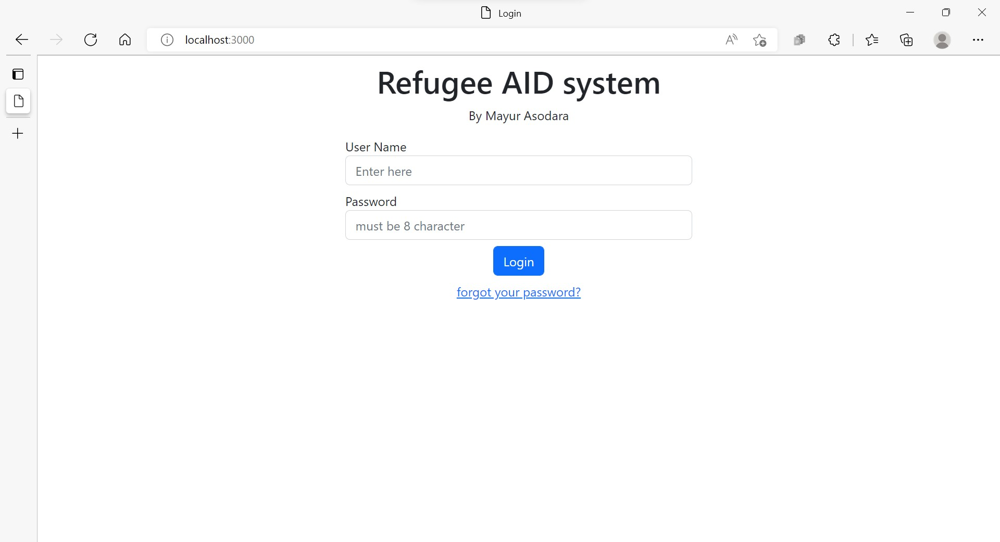

# Refugee AID system

<!-- ABOUT THE PROJECT -->
## About The Project

## Inspiration

There are close to 65 million refugees in the world in immediate need of food, water, clothing
and shelter. They have been forced to flee their homes due to political crisis, war,
socio-economic policies of strict regimes etc. And over 1.1 billion people are unable to prove
their rightful identities due to lack of proper legislation and upheaval. Getting each of them an
official identity so that they can receive social benefits from the government is an uphill task.
Refugee organizations are handicapped in their ability to serve so many people due to their
limited access to efficient and secure tools for identifying refugees.

##  What it does?

Our app helps refugee organizations efficiently and securely identify refugees who come to
refugee camps in search of food and shelter. It helps officers easily take photos of incoming
refugees, identify them or enter new user details, check their medical records and documents,
note daily movement of refugees across various camps and request resources from nearby
camps based on availability of resources. We harness the power of Deep Learning and
Blockchain to provide both efficiency and security in the identification process.

##  How we built it?

We used Microsoft’s Cognitive Services Toolkit, that uses deep learning based convolutional
neural networks, to analyse photos of incoming refugees, and test them against an existing
dataset of refugees’ facial photos. Based on whether the user is new or already registered, we
either retrieve their details from our Tierion blockchain or add their details to the blockchain. We
used Golang for the back-end server, and Javascript/HTML/CSS for the front-end client.

##  What's next for ?
We believe that this system can be deployed at several refugee camps all around the world.
Adding speech abilities and improved ways for managing resources among camps is important.
Building an easy way to counsel and connect refugees with mentors and financial resources is
an important future step for our app

### Prerequisites

* python
* node js

## Usage

*Our app helps refugee organizations efficiently and securely identify refugees who come to
refugee camps in search of food and shelter. It helps officers easily take photos of incoming
refugees, identify them or enter new user details, check their medical records and documents,
note daily movement of refugees across various camps and request resources from nearby
camps based on availability of resources. We harness the power of Deep Learning and
Blockchain to provide both efficiency and security in the identification process.

  

<!-- LICENSE -->
## License

Distributed under the MIT License. See `LICENSE` for more information.

<!-- CONTACT -->
## Contact

* Mayur Asodara - [linkedIn profile](https://www.linkedin.com/in/mayur-asodara-366067206), email_id - mayurasodara@gmail.com

Project Link: [https://github.com/mayuras7685/Under-water-trash-plastic-detection.git](https://github.com/mayuras7685/Under-water-trash-plastic-detection.git)
